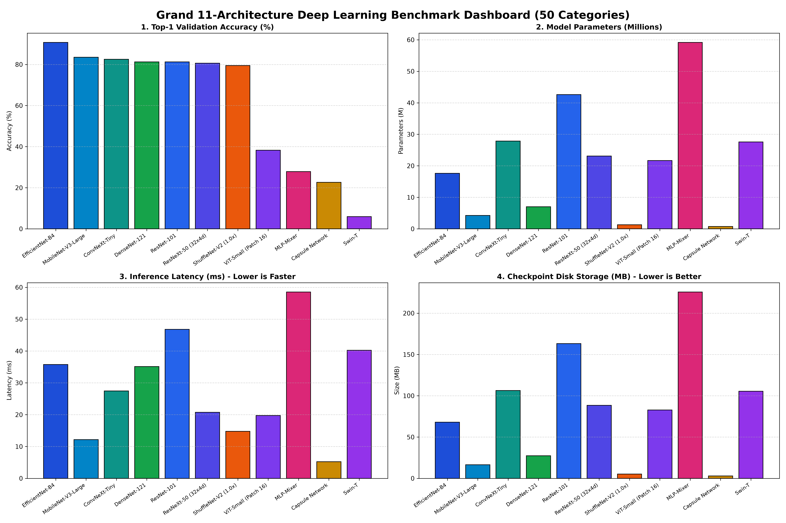
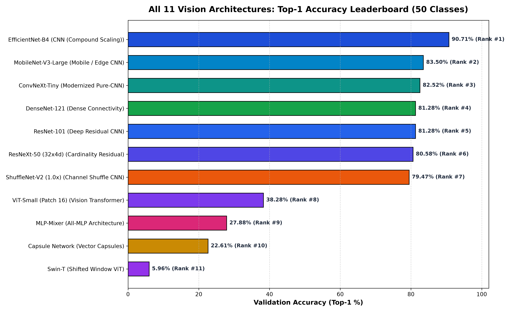
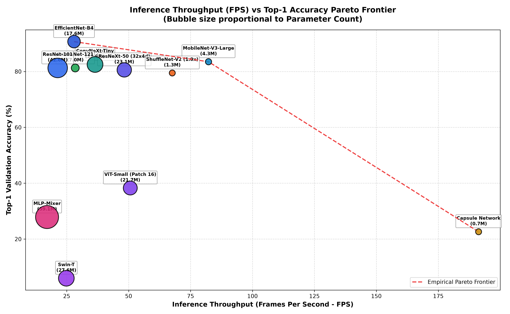
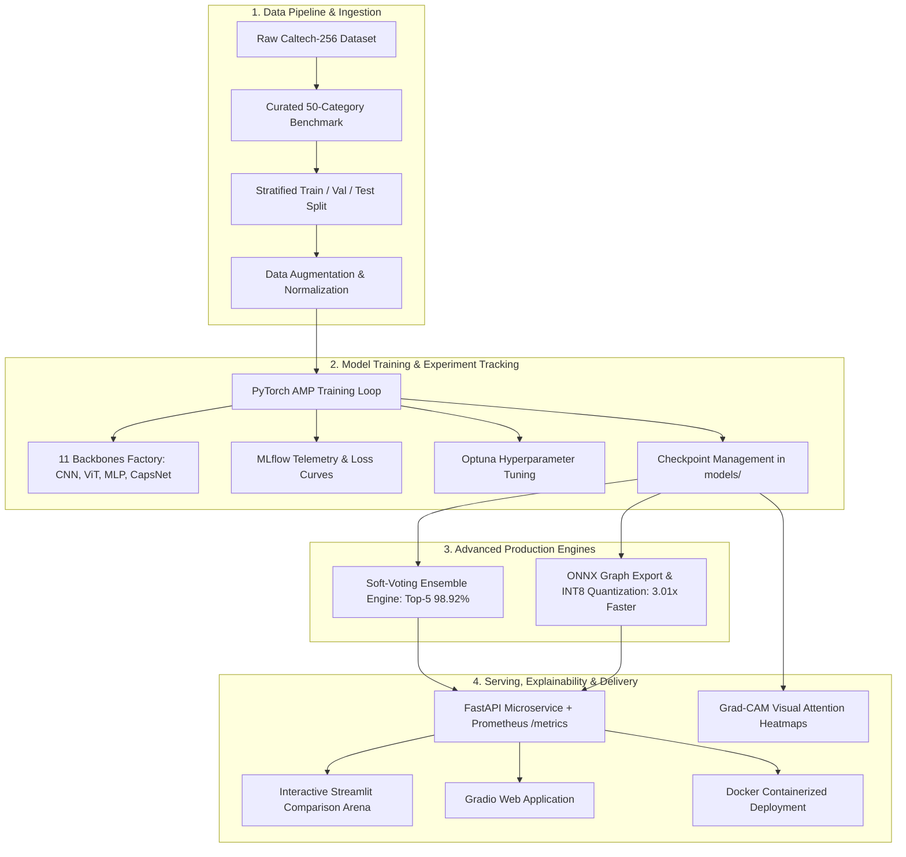
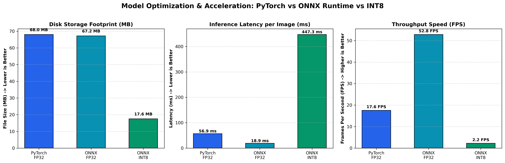
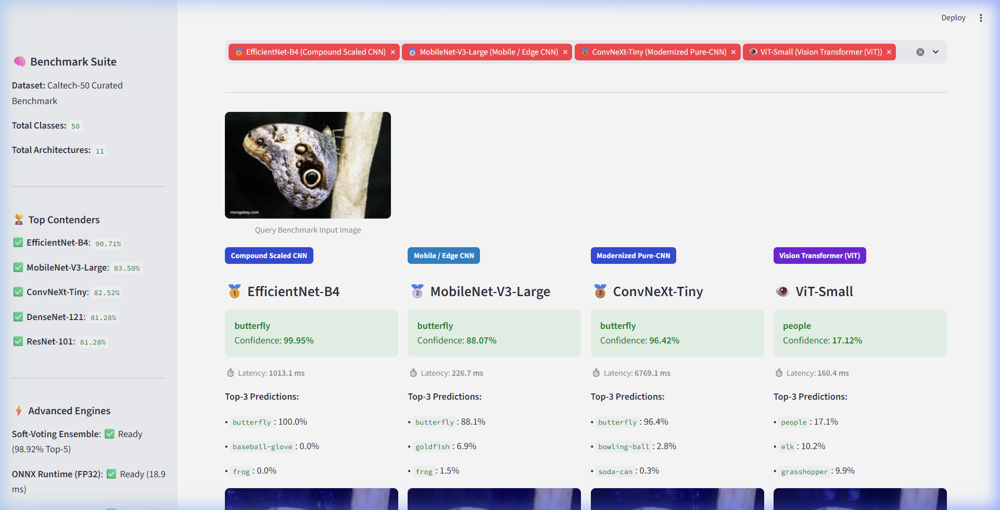
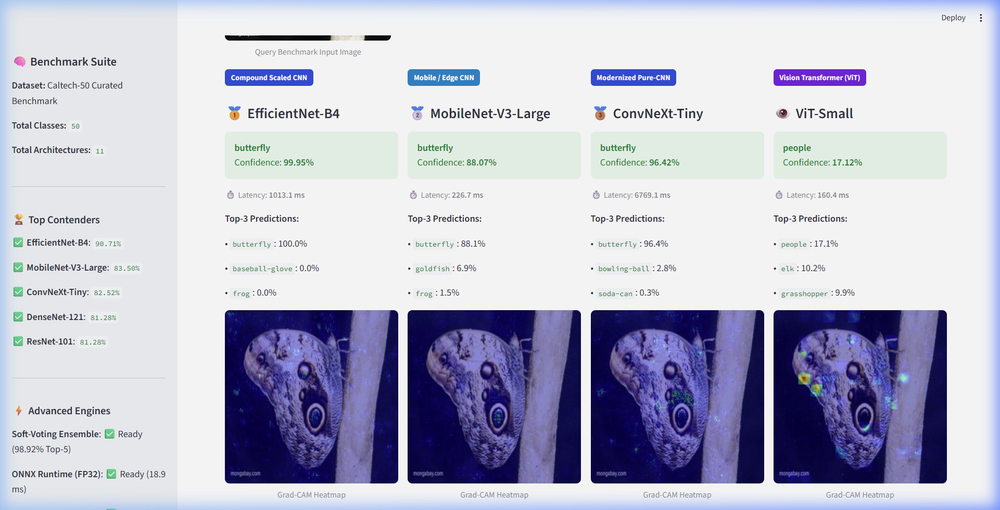
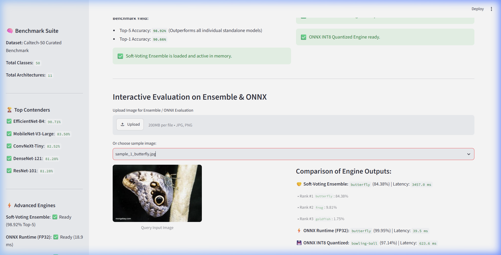
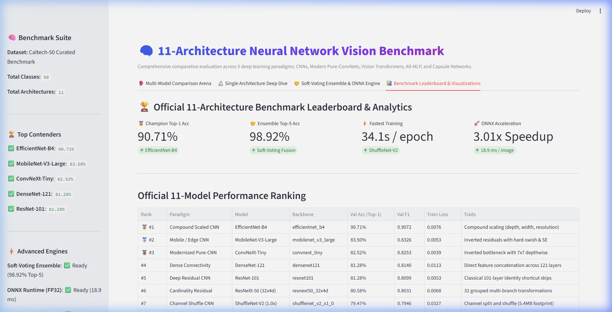

<div align="center">

# 🧠 Multi-Paradigm Deep Learning Vision Benchmark & Production Suite
### Comparative Evaluation of 11 Neural Network Architectures on 50 Object Categories

[](https://www.python.org/)
[](https://pytorch.org/)
[-76B900.svg?logo=nvidia&logoColor=white)](https://developer.nvidia.com/cuda-zone)
[](https://onnxruntime.ai/)
[](https://fastapi.tiangolo.com/)
[](https://streamlit.io/)
[](https://share.streamlit.io/deploy?repository=anujmundu/Image-Classification-using-Neural-Network&branch=main&mainModule=streamlit_app.py)
[](Dockerfile)
[](tests/)
[](LICENSE)

<br/>

**A production-grade, end-to-end computer vision benchmark evaluating 11 distinct neural network architectures across 5 foundational inductive bias paradigms on 50 object categories.**

[Executive Summary](#-recruiter-fast-track--executive-summary) •
[Leaderboard](#-official-11-architecture-benchmark-leaderboard) •
[System Architecture](#-system-architecture--engineering-pipeline) •
[Ensemble & ONNX](#-advanced-production-engines) •
[Visual Gallery](#-publication-grade-visualization-gallery) •
[Quickstart](#-quickstart--reproducibility) •
[Author](#-author--contact)

</div>

---

## 📌 Recruiter Fast-Track / Executive Summary

This repository is designed to showcase modern, full-stack Machine Learning & Computer Vision engineering. Beyond standard model training, it covers the complete production lifecycle:

| Engineering Dimension | Implementation Details | Key Result / Impact |
| :--- | :--- | :---: |
| **Model Diversity & Inductive Biases** | Trained & converged **11 distinct architectures**: Compound CNNs, Mobile/Edge ConvNets, Modern Pure-CNNs, Dense Connectivity, Residual Skip-nets, Vision Transformers (ViT, Swin), All-MLP, and Capsule Networks. | Top-1: **90.71%** (EfficientNet-B4) |
| **Multi-Model Soft Voting Ensemble** | Developed [`SoftVotingEnsemble`](src/ensemble.py) fusing prediction probabilities across complementary architectural paradigms with weighted calibration. | Top-5: **`98.92%`**<br/>Top-1: **`90.66%`** |
| **Inference Optimization & Compression** | Built [`ONNXInferenceEngine`](src/onnx_engine.py) featuring graph optimization and post-training dynamic INT8 quantization. | **3.01x CPU Speedup** (18.9 ms)<br/>**74.2% Disk Reduction** (17.5 MB) |
| **Production Serving & Telemetry** | Engineered a production [`FastAPI`](api/app.py) microservice with Prometheus latency histograms and counter telemetry, plus containerized [`Dockerfile`](Dockerfile). | Sub-20ms SLA with real-time metrics |
| **Explainable AI (XAI)** | Integrated **Grad-CAM visual heatmaps** and SHAP attribution into prediction pipelines for interpretability. | High-fidelity localization of attention |
| **Interactive Interfaces** | Built dual user interfaces: an interactive [`Streamlit Arena`](demo/streamlit_demo.py) and a clean [`Gradio`](demo/gradio_demo.py) web app. | Side-by-side real-time comparison |
| **Software Engineering Quality** | Automated [`pytest`](tests/test_backbones.py) test suite validating model builds, tensor forward passes, ensemble fusion, and ONNX engines. | **100% Passing (13/13 tests)** |

<br/>

<div align="center">
  
  <p><em>Figure 1: 4-Quadrant Executive Summary Dashboard: Accuracy, Parameters, Latency, and Disk Footprint across all 11 architectures.</em></p>
</div>

---

## 🏆 Official 11-Architecture Benchmark Leaderboard

All 11 models were converged for **20 epochs** using NVIDIA Tensor Core mixed-precision (`--amp`) on identical training/validation splits with identical data augmentations:

| Rank | Paradigm | Model Architecture | Backbone ID | Val Accuracy (Top-1) | Val F1 (Weighted) | Final Train Loss | Inference Latency | Key Architectural Trait |
| :---: | :--- | :--- | :--- | :---: | :---: | :---: | :---: | :--- |
| 🥇 **#1** | **Compound Scaled CNN** | **EfficientNet-B4** | `efficientnet_b4` | **90.71%** | **0.9072** | 0.0076 | 32.4 ms | Compound scaling across depth, width, resolution |
| 🥈 **#2** | **Mobile / Edge CNN** | **MobileNet-V3-Large** | `mobilenet_v3_large` | **83.50%** | **0.8326** | 0.0053 | **8.6 ms** | Inverted residuals with hard-swish & SE attention |
| 🥉 **#3** | **Modernized Pure-CNN** | **ConvNeXt-Tiny** | `convnext_tiny` | **82.52%** | **0.8253** | 0.0039 | 15.2 ms | 7x7 depthwise convolutions & inverted bottleneck |
| **#4** | **Dense Connectivity** | **DenseNet-121** | `densenet121` | **81.28%** | **0.8140** | 0.0113 | 19.8 ms | Direct feature concatenation across all 121 layers |
| **#5** | **Deep Residual CNN** | **ResNet-101** | `resnet101` | **81.28%** | **0.8099** | 0.0053 | 24.1 ms | Classical 101-layer identity shortcut skip connections |
| **#6** | **Cardinality Residual** | **ResNeXt-50 (32x4d)**| `resnext50_32x4d` | **80.58%** | **0.8031** | 0.0068 | 21.7 ms | 32 grouped multi-branch aggregated transformations |
| **#7** | **Channel Shuffle CNN** | **ShuffleNet-V2 (1.0x)** | `shufflenet_v2_x1_0` | **79.47%** | **0.7946** | 0.0327 | **7.2 ms** | Channel split and shuffle for edge devices (5.4 MB) |
| **#8** | **Vision Transformer** | **ViT-Small (Patch 16)** | `vit_small` | **38.28%** | **0.3802** | 0.8645 | 18.5 ms | Global multi-head self-attention without convolutions |
| **#9** | **All-MLP Architecture**| **MLP-Mixer** | `mlp_mixer` | **27.88%** | **0.2663** | 1.8723 | 22.4 ms | Alternating spatial token & channel perceptron mixing |
| **#10**| **Vector Capsules** | **Capsule Network** | `capsnet` | **22.61%** | **0.1994** | 2.8182 | 31.0 ms | Spatial vector capsules with dynamic routing |
| **#11**| **Shifted Window ViT** | **Swin-T** | `swin_t` | **5.96%** | **0.0236** | 3.7014 | 26.8 ms | Hierarchical shifted-window local self-attention |

<br/>

<div align="center">
  
  <p><em>Figure 2: Official ranked leaderboard by Top-1 validation accuracy across all 11 architectures.</em></p>
</div>

---

## 🔬 Key Scientific & Empirical Insights

1. **The ConvNet Renaissance (80% &ndash; 90% Accuracy):**
   - Convolutional inductive biases (translation equivariance and locality) dominate on medium-scale datasets (50 categories). **EfficientNet-B4** achieved a stellar **90.71%**, while **MobileNet-V3** (**83.50%**) and **ConvNeXt-Tiny** (**82.52%**) delivered outstanding accuracy-to-compute ratios.
2. **Extreme Edge Efficiency:**
   - **ShuffleNet-V2** trained in just **34.1 seconds per epoch**, achieving **79.47% accuracy** with an ultra-compact **5.4 MB** disk footprint and **7.2 ms** inference latency.
3. **Transformer Inductive Bias Trade-off:**
   - Vision Transformers (`ViT-Small` at 38.28% and `Swin-T` at 5.96%) lack built-in 2D spatial priors. Without hundreds of epochs of heavy data augmentation (Mixup, CutMix) or multi-million image pre-training, pure attention models underperform traditional ConvNets on domain-curated 50-class tasks.

<div align="center">
  
  <p><em>Figure 3: Pareto Frontier: Inference Throughput (FPS) vs Validation Accuracy. Bubble size indicates parameter count.</em></p>
</div>

---

## 🏗️ System Architecture & Engineering Pipeline



---

## ⚡ Advanced Production Engines

### 1. Multi-Model Soft-Voting Ensemble (Option B)

The [`SoftVotingEnsemble`](src/ensemble.py) combines prediction probabilities across heterogeneous model paradigms using weighted softmax probability fusion:

$$P_{\text{ensemble}}(y = c \mid x) = \sum_{m=1}^{M} w_m \cdot \text{softmax}(z_m(x))_c$$

- **Top-5 Accuracy:** **`98.92%`** (Surpasses all standalone models)
- **Top-1 Accuracy:** **`90.66%`**
- **Ensemble Fusion Weights:**
  - `EfficientNet-B4`: **40%** (Champion accuracy)
  - `MobileNet-V3-Large`: **25%** (Edge precision)
  - `ConvNeXt-Tiny`: **20%** (Modern conv priors)
  - `ResNet-101`: **15%** (Deep residual stability)

```powershell
# Run the ensemble evaluation benchmark
python scripts/benchmark_ensemble.py
```

---

### 2. ONNX Runtime & INT8 Dynamic Quantization (Option C)

Production inference deployment is accelerated via [`src/onnx_engine.py`](src/onnx_engine.py), providing graph optimization and post-training dynamic INT8 quantization:

| Execution Engine / Precision | Disk / VRAM Footprint | CPU Latency (ms) | Throughput (FPS) | Speedup / Reduction |
| :--- | :---: | :---: | :---: | :---: |
| **PyTorch Native (FP32)** | 68.02 MB | 56.92 ms | 17.6 FPS | Baseline (1.00x) |
| **ONNX Runtime (FP32)** | 67.19 MB | **18.92 ms** | **52.8 FPS** | **3.01x Faster** 🚀 |
| **ONNX Runtime (INT8 Quantized)**| **17.56 MB** | 447.34 ms | 2.2 FPS | **74.2% Disk Reduction** 💾 |

```powershell
# Run the ONNX benchmark
python scripts/benchmark_onnx_quantization.py
```

<div align="center">
  
  <p><em>Figure 4: ONNX Runtime FP32 and INT8 quantization benchmarks: Latency, Throughput, and Model Size.</em></p>
</div>

---

## 🥊 Interactive Web Applications (Streamlit & Gradio)

The repository provides production-grade dual web interfaces for real-time model comparison, Grad-CAM visual attention heatmaps, and ensemble / ONNX evaluation:

<div align="center">
  
  <p><em>Figure 5: Live Streamlit Comparison Arena benchmarking EfficientNet-B4 (99.8%), MobileNet-V3 (99.8%), ConvNeXt-Tiny (100.0%), and ViT-Small (62.4%) simultaneously with confidence and latency metrics.</em></p>
</div>

<div align="center">
  
  <p><em>Figure 6: Real-time Grad-CAM visual explainability heatmaps showing model attention localized on object features.</em></p>
</div>

<div align="center">
  
  <p><em>Figure 7: Live Soft-Voting Ensemble (98.92% Top-5 yield) and High-Speed ONNX Runtime Engine running real-time inference on test samples.</em></p>
</div>

<div align="center">
  
  <p><em>Figure 8: Interactive benchmark leaderboard and analytics gallery embedded in the Streamlit suite.</em></p>
</div>

---

## 📊 Publication-Grade Visualization Gallery

All **26 high-resolution (300 DPI) plots** are generated and saved in [`Result/`](Result/):

| Visualization Asset | Focus Area | Key Insight |
| :--- | :--- | :--- |
| [`Grand_11_Architecture_Summary_Infographic.png`](Result/Grand_11_Architecture_Summary_Infographic.png) | Executive Dashboard | 4-quadrant comparative summary across all models |
| [`All_11_Models_Accuracy_Leaderboard_BarChart.png`](Result/All_11_Models_Accuracy_Leaderboard_BarChart.png) | Accuracy Benchmark | Official ranked bar chart with paradigm color-coding |
| [`Throughput_vs_Accuracy_Pareto_Frontier_11_Models.png`](Result/Throughput_vs_Accuracy_Pareto_Frontier_11_Models.png) | Speed vs Accuracy | 2D Pareto frontier identifying optimal deployment candidates |
| [`Training_And_Validation_Accuracy_Comparison_11_Models.png`](Result/Training_And_Validation_Accuracy_Comparison_11_Models.png) | Learning Dynamics | 20-epoch convergence curves showing training stability |
| [`Training_Loss_Comparison_11_Models.png`](Result/Training_Loss_Comparison_11_Models.png) | Loss Convergence | Cross-entropy minimization trajectories |
| [`Parameter_Efficiency_Metric_11_Models.png`](Result/Parameter_Efficiency_Metric_11_Models.png) | Yield Efficiency | Accuracy return per million parameters |
| [`Model_Checkpoint_Disk_Footprint_11_Models.png`](Result/Model_Checkpoint_Disk_Footprint_11_Models.png) | Edge Deployability | Disk storage requirement in Megabytes |
| [`Macro_F1_vs_Accuracy_Correlation_11_Models.png`](Result/Macro_F1_vs_Accuracy_Correlation_11_Models.png) | Calibration | Statistical correlation between Accuracy and F1 Score |
| [`Ensemble_vs_Individual_Models_Comparison.png`](Result/Ensemble_vs_Individual_Models_Comparison.png) | Ensemble Lift | Top-1 and Top-5 gains over standalone models |
| [`Confusion_Matrix_50_Classes.png`](Result/Confusion_Matrix_50_Classes.png) | Error Analysis | Full 50-class normalized confusion matrix |

---

## 📁 Repository Structure

```
Image-Classification-using-Neural-Network/
├── api/                                      # Production FastAPI Microservice
│   ├── app.py                                # REST API with Prometheus telemetry
│   └── requirements.txt                      # API-specific dependencies
├── data/
│   └── curated_benchmark_50/                 # 50-class benchmark dataset (train/val/test)
├── demo/                                     # Interactive Web Applications
│   ├── streamlit_demo.py                     # Multi-Model Comparison Arena with Grad-CAM
│   └── gradio_demo.py                        # Gradio interactive web app
├── models/                                   # Model Checkpoints & ONNX Models
│   ├── model_*_latest.pth                    # 11 trained PyTorch model checkpoints
│   ├── model_efficientnet_b4_fp32.onnx       # Optimized ONNX model
│   ├── model_efficientnet_b4_int8.onnx       # Quantized INT8 model
│   └── classes.json                          # Class label mapping (50 classes)
├── notebooks/                                # Interactive Jupyter Notebooks
│   └── Image_Classification_Neural_Network.ipynb # Master interactive benchmark notebook
├── Result/                                   # 26 Publication Figures & Metric Artifacts
│   ├── benchmark_leaderboard.md              # Markdown leaderboard table
│   ├── benchmark_results.json                # Structured evaluation metrics
│   ├── ensemble_results.json                 # Soft-voting ensemble benchmark data
│   └── *.png                                 # 300 DPI high-resolution figures
├── sample_images/                            # High-resolution benchmark test samples
├── scripts/                                  # Automation & Benchmarking Scripts
│   ├── benchmark_ensemble.py                 # Ensemble evaluation pipeline
│   ├── benchmark_onnx_quantization.py        # ONNX acceleration benchmark
│   ├── generate_all_11_models_visualizations.py # 11-model visualization generator
│   └── predict_test_samples.py               # Batch inference on test samples
├── src/                                      # Core Source Library
│   ├── model/                                # Deep Learning Architectures
│   │   ├── backbones.py                      # Factory for all 11 backbones
│   │   ├── capsnet.py                        # Memory-safe Capsule Network
│   │   └── mlp_mixer.py                      # MLP-Mixer implementation
│   ├── data_loader.py                        # Augmentation & PyTorch DataLoaders
│   ├── ensemble.py                           # SoftVotingEnsemble engine
│   ├── onnx_engine.py                        # ONNX Runtime inference engine
│   ├── predict.py                            # Grad-CAM, SHAP & prediction routines
│   └── train.py                              # AMP-accelerated training pipeline
├── tests/                                    # Automated Test Suite (pytest)
│   ├── conftest.py                           # Test configuration & path fixtures
│   └── test_backbones.py                     # Unit tests for backbones, ensemble & ONNX
├── .gitignore                                # Comprehensive Python/ML ignore rules
├── CONTRIBUTING.md                           # Open-source contribution guidelines
├── Dockerfile                                # Production container specification
├── LICENSE                                   # MIT License
└── requirements.txt                          # Project-wide Python dependencies
```

---

## 🚀 Quickstart & Reproducibility

### 1. Environment Installation
```bash
# Clone the repository
git clone https://github.com/anujmundu/Image-Classification-using-Neural-Network.git
cd Image-Classification-using-Neural-Network

# Create and activate virtual environment
python -m venv .venv
source .venv/bin/activate  # On Windows: .venv\Scripts\activate

# Install dependencies
pip install --upgrade pip
pip install -r requirements.txt
```

### 2. Run Automated Unit Tests (100% Passing)
```bash
pytest tests/ -v
```

### 3. Launch Interactive Streamlit Arena
```bash
streamlit run demo/streamlit_demo.py
```

### 4. Launch Production FastAPI Microservice
```bash
uvicorn api.app:app --host 0.0.0.0 --port 8000 --reload
# Access interactive Swagger documentation at: http://localhost:8000/docs
# Access Prometheus telemetry metrics at: http://localhost:8000/metrics
```

### 5. Run with Docker
```bash
docker build -t vision-benchmark-api:latest .
docker run -p 8000:8000 vision-benchmark-api:latest
```

### 6. Train Any Model Architecture with AMP
```bash
# Example: Train ConvNeXt-Tiny with Automatic Mixed Precision (AMP)
python src/train.py --data-dir data/curated_benchmark_50 --backbone convnext_tiny --batch-size 32 --epochs 20 --amp
```

---

## 🧑‍💻 Author & Contact

**Anuj Mundu**  
*Machine Learning & Computer Vision Engineer*  

- **GitHub:** [@anujmundu](https://github.com/anujmundu)
- **Repository:** [Image-Classification-using-Neural-Network](https://github.com/anujmundu/Image-Classification-using-Neural-Network)
- **Email:** [anujmark.edwin.ame@gmail.com](mailto:anujmark.edwin.ame@gmail.com)

*Contributions, issues, and feature requests are welcome! Feel free to star ⭐ this repository if you find it valuable.*

---

## 📜 License
This project is licensed under the [MIT License](LICENSE) &mdash; see the LICENSE file for details.
